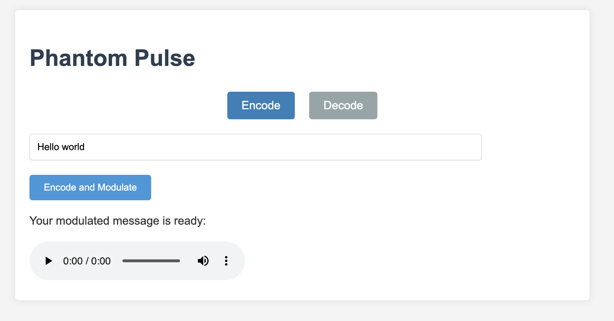

# Phantom Pulse
Phantom Pulse is a Rust-based web application for encoding text messages into WAV audio files using frequency-shift keying (FSK) and decoding them back to text, enabling data transmission through audio channels.

<p align="center">
  
</p>

## Features

- Encode text messages into WAV audio files
- Decode WAV audio files back to text messages
- Web-based interface for easy interaction
- RESTful API endpoints for encoding and decoding

## Installation

You can install and run Phantom Pulse either directly on your system or using Docker.

### Option 1: Direct Installation

1. Ensure you have Rust and Cargo installed on your system. If not, install them from [https://www.rust-lang.org/](https://www.rust-lang.org/).

2. Clone the repository:
   ```
   git clone https://github.com/headstylecolorred/phantom-pulse.git
   cd phantom-pulse
   ```

3. Build and run the project:
   ```
   cargo run
   ```

### Option 2: Docker Installation

1. Ensure you have Docker and Docker Compose installed on your system. If not, install them from [https://docs.docker.com/get-docker/](https://docs.docker.com/get-docker/).

2. Clone the repository:
   ```
   git clone https://github.com/headstylecolorred/phantom-pulse.git
   cd phantom-pulse
   ```

3. Build and run the Docker container:
   ```
   docker-compose up --build
   ```

For both options, the server will start running on `http://localhost:3030`.

## Usage

Phantom Pulse provides a web interface and API endpoints for encoding and decoding messages:

### Web Interface

<p align="center">
  
</p>

Access the web interface by opening `http://localhost:3030` in your web browser. The interface allows you to:

- Enter text messages to encode into WAV files
- Upload WAV files to decode back into text messages

### API Endpoints

1. Encode a message:
   ```js
   POST /encode
   Content-Type: application/json

   {
     "message": "Your secret message"
   }
   ```
   This returns a WAV file containing the encoded message.

2. Decode a WAV file:
   ```js
   POST /decode
   Content-Type: multipart/form-data

   file: [WAV file to decode]
   ```
   This returns a JSON object containing the decoded message:
   ```json
   {
     "decoded_message": "Your secret message"
   }
   ```

3. Health check:
   ```
   GET /health
   ```
   Returns "Server is up and running" if the server is operational.

## Technical Details

- Backend: Rust with Warp web framework
- Encoding: Text to binary, then to audio frequencies
- Modulation: Binary FSK (Frequency-Shift Keying)
  - 1000 Hz represents binary 0
  - 2000 Hz represents binary 1
- Audio: 44.1 kHz sample rate, 16-bit depth
- Decoding: Correlation-based algorithm for frequency detection

### How It Works

1. Encoding:
   - The input text is converted to binary.
   - Each binary digit is represented by a specific frequency (1000 Hz or 2000 Hz).
   - These frequencies are combined to create a WAV audio file.

2. Decoding:
   - The WAV file is analyzed using a correlation-based algorithm.
   - The algorithm detects which frequency is present for each time segment.
   - Based on the detected frequencies, the binary data is reconstructed.
   - The binary data is then converted back to text.

## Project Structure

- `/src`: Contains the Rust source code
  - `main.rs`: Server setup and route definitions
  - `/routes`: Contains handler functions for API endpoints
  - `/helpers`: Utility functions for encoding, decoding, and error handling
- `/web`: Contains the front-end files (HTML, CSS, JavaScript)

## Legal and Safety

**Important:** This software is designed for educational purposes only. Be aware of the legal implications of transmitting encoded messages, especially over radio frequencies. Always ensure you comply with local laws and regulations.

## Contributing

Contributions to Phantom Pulse are welcome! Please feel free to submit pull requests, create issues or spread the word.

## License
